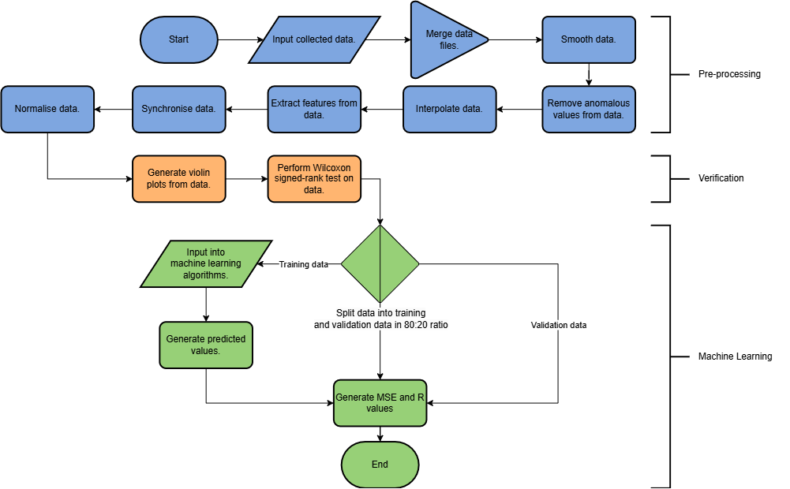

# What this is

I wanted to use the data I collected with my [Environmental Data Collection System](https://github.com/MoodyMarshmallow/Environmental-Data-Collection-System) to train a machine-learning model to predict soil moisture values in high temporal resolution. In the process, I hoped to gain some practical knowledge on how to implement machine learning models.

# What the code does

  

**1. Pre-Processing** – First, I had to merge the various output files I had extracted into one output file (this included decoding one incorrectly formatted output file). Then I did all the usual pre-processing steps of removing anomalous datapoints and interpolating the small gaps that this created, extracting more features for ML, synchronise datapoints so that each the modalities were logged at the same time, and normalise the data to make the learning porcess easier.

**2. Verification** – I wanted to run a few tests before conducting the actual machine learning porcess to evaluate the suitability of the data for machine learning, so I made some voilin plots to roughly see if there were any patterns within the data.

**3. Machine Learning** – I trained and compared the performance of several different models on my data. The most accurate model turned out to be the random forest model, which achieved an R-value of 0.84.

# Problems I Faced

The biggest issue affecting the accuracy of my machine learning models was probably the quality of the data. I realised by evaluating the data that there were far more variables that I needed to collect in order to create a good soil moisture prediction model (e.g. sooil mositure at different depths in the ground). Nonetheless, I learned a lot about how to handle data, as well as how to use it in a ML implementation, so I'm quite happy with the results.

# Further Reading

You can read a more in-depth discussion of this project in [this paper](https://doi.org/10.1109/ICMIMT59138.2023.10199334)
